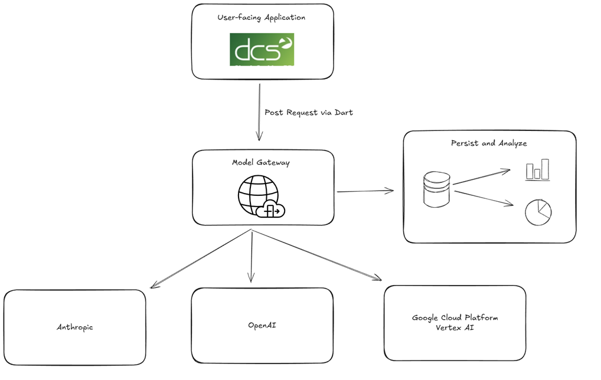
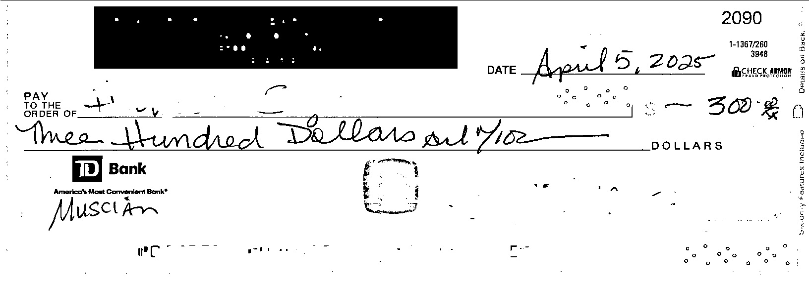
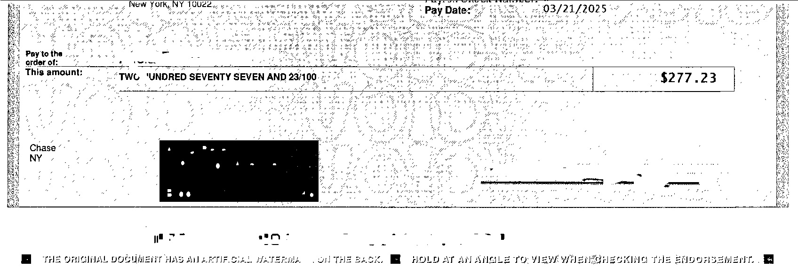

# Large Language Model Gateway
## Overview

This application is a gateway for DCS applications to make use of modern AI models and techniques. It bridges Visual Basic 6 (VB6) with LLM APIs (OpenAI, Anthropic, Google, etc), enabling existing VB6 applications to benefit from modern AI capabilities.

While VB6 is capable of making basic HTTP requests, it lacks comprehensive support for modern HTTPS communication and is not likely to receive native clients to work with modern AI. Java provides a balance of being a common language and providing high enough performance. This middleware acts as a translator between VB6 and modern AI APIs.

## Features
- Accepts requests from VB6 applications via HTTP.
- Formulates the appropriate prompts to effectively use AI APIs (e.g., GPT-4, claude-3-7-sonnet, Google Vertex AI).
  - pass-through is also possible
- Returns OpenAI's response in a variety of friendly formats (for VB6).
- Basic input validation and error handling.
- Lightweight and easy to deploy.
- Tracks and records usage and cost.
- Stores prompts and replies for audit and debugging purposes.
- Can be used to screen for sensitive information and prevent accidental data leaks

## Architecture



## Deployment
Can be deployed:
- on the same host as the main DCS application
- on the same network as the main application, shared by a few hosts
- as a centralized multi-tenant application shared by many hosts
- a docker sidecar (if running in Kubernetes or similar)

The application starts an HTTP server listening on port 8080 (or otherwise, as specified in config)

## API Specification
Parse date and amount from check image:
```
POST /api/check/process

Request:
{
  "file": "<check image bytes>"
}

Response:
{
  "checkDate": "2025/04/01",
  "amount": "123.45"
}
```

### Error Handling

    400 Bad Request: Missing or invalid input.
    401 Unauthorized: Missing or invalid API key (if enabled).
    500 Internal Server Error: Unexpected failure in processing.

## Development
### Environment
- download java 21
- download maven
- download git
- intall cursor plugins
  - java
  - maven
  - git

### Application
- Clone the Repository
- Set OpenAI API Key
- Execute via maven

On Windows:
```
$env:OPENAI_API_KEY = "<your_api_key_here>"
mvn spring-boot:run
```

Mac/Linux:
```
OPENAI_API_KEY=<your_api_key_here> mvn spring-boot:run
```


## Operational Considerations

For production use:
- outgoing data is scanned for inadvertent leakage of PI
- all requests and responses are logged
- API keys are regularly rotated
- network-level rules are in place to ensure only trusted clients
- rate limits and usage quotas are maintained

---

# How did we get here?
The following is a description of the steps taken to write this application making maximal use of AI for application development as well as the implementation:
- prompt cursor for a web application which parses date and amount from a check image
- cursor provided a working Spring Boot API with an endpoint which accepts an image
- the image processing was done using the open source OCR library [tesseract](https://github.com/tesseract-ocr/tesseract)
- this is worth exploring int he future, but we decided to pivot to modern LLMs 
- we asked the agent for other options and it implemented an Open AI API call
- the agent provided instructions to test the API from the command line using curl
- we asked for a swagger UI to make testing quicker and easier
- tried a few check images (attached below) with non-trivial issues - all were successful!
- AI was then used to write this document

### Check 1


### Check 2


### Check 3


## Next Steps
- Test against large number of checks with different models and collect metrics
- Decide on tradeoffs in terms of speed, cost, correctness
- Add more remote models
- Try deploying a model locally (llama or otherwise)

## Decisions
- Deployment model (local, remote)
- Model selection (Open AI, Anthropic, Meta)
- Quality vs price (bleeding edge model vs older, big vs mini)